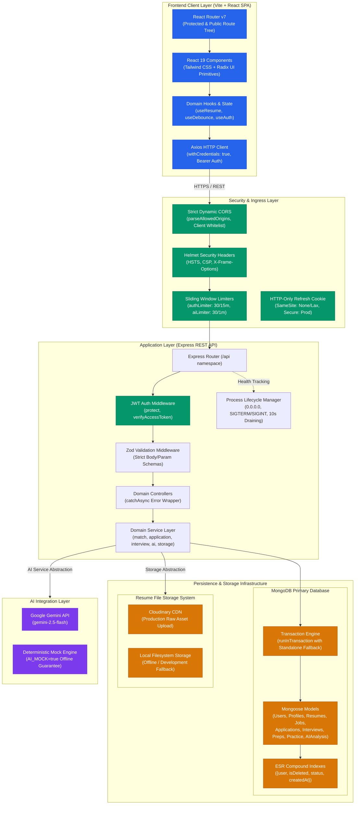
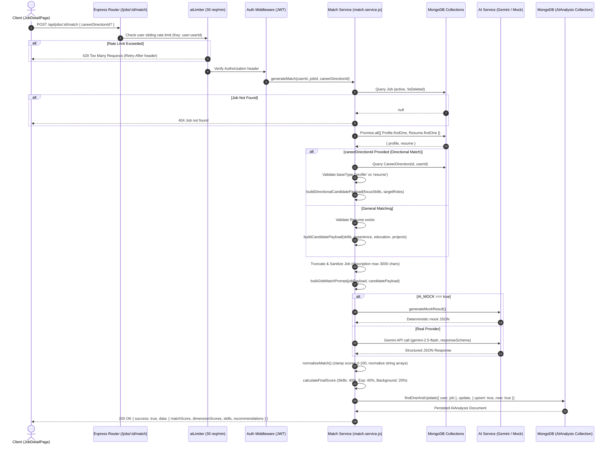

# CareerFlow — System Architecture & Technical Specifications

> Complete architectural documentation, database design, transaction isolation, security boundaries, and core sequence data flows across the CareerFlow full-stack platform.

---

## 1. Executive Architectural Overview

CareerFlow is engineered with a decoupled, high-performance **Client-Server Architecture** utilizing a **Layered Domain-Driven (MVC + Service Layer)** pattern on the backend and a **Modular Single-Page Application (SPA)** architecture on the frontend.

```
+-------------------------------------------------------------------------------+
|                                CLIENT TIER                                    |
|   React 19 SPA + Vite + Tailwind CSS + Radix UI Primitives + Custom Hooks     |
+---------------------------------------+---------------------------------------+
                                        | HTTPS / JSON (REST APIs + Cookies)
+---------------------------------------v---------------------------------------+
|                                SECURITY INGRESS                               |
|   Strict Dynamic CORS Whitelist + Helmet Security Headers + Sliding Limiters  |
+---------------------------------------+---------------------------------------+
                                        | Clean Ingress
+---------------------------------------v---------------------------------------+
|                               EXPRESS APP TIER                                |
|   Express Router -> JWT Auth -> Zod Validation -> Controllers -> Service Layer |
+------------------+--------------------+-------------------+-------------------+
                   |                    |                   |
+------------------v----+ +-------------v---------+ +-------v-------------------+
|     PERSISTENCE       | |       OBJECT STORE    | |     ARTIFICIAL INTEL      |
| MongoDB 6+ Database   | | Cloudinary CDN        | | Google Gemini LLM         |
| (ESR Indexes, Atomic  | | (Raw CV Uploads with  | | (gemini-2.5-flash with    |
| Multi-Document Txns)  | | Local Storage Fallback)| | Deterministic Mocks)     |
+-----------------------+ +-----------------------+ +---------------------------+
```

### Core Design Principles
1. **Separation of Concerns**: Controllers exclusively orchestrate request/response serialization; business rules, aggregations, and third-party integrations reside in dedicated domain services.
2. **Defensive Data Integrity**: Multi-document transactions guarantee atomicity during cascade deletions, while database schemas enforce Equality-Sort-Range (ESR) index compliance.
3. **Network Efficiency**: Waterfall-heavy page initializations are collapsed into single-trip composite endpoints, executing intra-datacenter parallel queries via `Promise.all`.
4. **Resilient AI Pipeline**: Deterministic fallback mocks (`AI_MOCK=true`) guarantee 100% test reliability and offline development support without external cloud dependencies.
5. **Strict Boundary Validation**: Inbound payloads are validated using Zod before reaching controllers, and AI responses are clamped, typed, and normalized prior to persistence.

---

## 2. System Architecture Diagrams

### 2.1 High-Level System Architecture & Ingress Boundary



---

### 2.2 Sequence Diagram: AI Job Fit Analysis (Directional & General Matching)



---

### 2.3 Sequence Diagram: Composite Dashboard Loading (Zero-Waterfall Aggregation)

```mermaid
sequenceDiagram
    autonumber
    actor Client as Client (DashboardPage)
    participant API as /api/dashboard/overview
    participant Auth as Auth Middleware (JWT)
    participant DashService as Dashboard Service
    participant Mongo as MongoDB Database

    Client->>API: GET /api/dashboard/overview
    API->>Auth: Validate JWT Session
    Auth->>DashService: getDashboardOverview(userId)

    Note over DashService,Mongo: Single Round-Trip: 5 Parallel Database Queries via Promise.all
    parallel
        DashService->>Mongo: 1. Job.countDocuments({ user, isDeleted: false })
    and
        DashService->>Mongo: 2. Interview.countDocuments({ user })
    and
        DashService->>Mongo: 3. getApplicationPipeline(userId) (Status count breakdown)
    and
        DashService->>Mongo: 4. Interview.findOne({ scheduledDate >= now }).sort(1).populate().lean()
    and
        DashService->>Mongo: 5. getDashboard(userId) (PracticeSession scores & averages)
    end

    Mongo-->>DashService: [ activeJobsCount, totalInterviews, pipeline, nextInterview, practice ]

    DashService->>DashService: Assemble composite response envelope
    DashService-->>API: { overview, pipeline, nextInterview, practice }
    API-->>Client: 200 OK (Single unified payload)
```

---

### 2.4 Sequence Diagram: Atomic Cascade Deletion with Transaction Fallback

```mermaid
sequenceDiagram
    autonumber
    actor Client as Client (ApplicationDetailPage)
    participant API as DELETE /api/applications/:id
    participant TxEngine as runInTransaction (transaction.js)
    participant Topology as MongoDB Driver Topology
    participant AppService as Application Service
    participant DB as MongoDB Collections

    Client->>API: DELETE /api/applications/:id
    API->>AppService: deleteApplication(userId, applicationId)
    AppService->>TxEngine: runInTransaction(workFn)
    TxEngine->>Topology: supportsTransactions() (Check ReplicaSetWithPrimary / Sharded)

    alt Multi-Document Transactions Supported (Replica Set / Atlas)
        TxEngine->>DB: mongoose.startSession()
        TxEngine->>DB: session.withTransaction(workFn)
        
        AppService->>DB: Application.findOne({ _id, user }).session(session)
        alt Application Not Found
            AppService-->>Client: 404 Application not found
        end

        AppService->>DB: Interview.find({ user, application }).select('_id').session(session)
        DB-->>AppService: interviewIds = [id1, id2, ...]

        opt interviewIds.length > 0
            Note over AppService,DB: Parallel Atomic Deletion of Children
            parallel
                AppService->>DB: InterviewPreparation.deleteMany({ interview: { $in: interviewIds } }, { session })
            and
                AppService->>DB: PracticeSession.deleteMany({ interview: { $in: interviewIds } }, { session })
            and
                AppService->>DB: Interview.deleteMany({ _id: { $in: interviewIds } }, { session })
            end
        end

        AppService->>DB: application.deleteOne({ session })
        TxEngine->>DB: Commit Transaction
        TxEngine->>DB: session.endSession()
        AppService-->>Client: 200 OK { success: true, message: "Application deleted successfully" }

    else Standalone Instance Fallback (Local Dev / CI)
        TxEngine->>AppService: Execute workFn(session = null)
        AppService->>DB: Application.findOne({ _id, user })
        AppService->>DB: Interview.find({ user, application }).select('_id')
        AppService->>DB: Parallel Direct Deletes (No session flag)
        AppService->>DB: application.deleteOne()
        AppService-->>Client: 200 OK { success: true, message: "Application deleted successfully" }
    end
```

---

## 3. Database Architecture & Schema Indexing (ESR Strategy)

The database schema strictly adheres to the **Equality, Sort, Range (ESR)** rule for MongoDB indexing, eliminating in-memory sorting (`COLLSCAN` and `SORT_KEY_GENERATOR`) on high-traffic endpoints.

### 3.1 ESR Index Inventory

| Collection | Compound Index Specification | Index Type | Target Query Pattern / Purpose |
| :--- | :--- | :--- | :--- |
| **`jobs`** | `{ user: 1, isDeleted: 1, createdAt: -1 }` | Compound (ESR) | Fetching active jobs ordered by latest creation date |
| **`jobs`** | `{ user: 1, isDeleted: 1, status: 1, createdAt: -1 }` | Compound (ESR) | Fetching active jobs filtered by status (`saved`, `applied`, etc.) |
| **`jobs`** | `{ user: 1, sourceUrl: 1 }` (Partial) | Compound Unique | Prevents duplicate job URLs per user. Filter: `{ sourceUrl: { $type: 'string' }, isDeleted: false }` |
| **`applications`** | `{ user: 1, job: 1 }` | Compound Unique | Enforces exactly one application per job per user |
| **`applications`** | `{ user: 1, createdAt: -1 }` | Compound (ESR) | Default chronological application listing |
| **`applications`** | `{ user: 1, status: 1, createdAt: -1 }` | Compound (ESR) | Filtering applications by pipeline stage (`screening`, `interviewing`) |
| **`interviews`** | `{ user: 1, createdAt: -1 }` | Compound (ESR) | Reverse-chronological interview listing |
| **`interviews`** | `{ user: 1, status: 1, createdAt: -1 }` | Compound (ESR) | Status-filtered interview queries |
| **`interviews`** | `{ user: 1, application: 1, createdAt: -1 }` | Compound (ESR) | Cascade lookups and application-specific interview timelines |
| **`interviewpreparations`** | `{ user: 1, interview: 1 }` | Compound Unique | Strict 1-to-1 relationship between Interview and AI Preparation questions |
| **`practicesessions`** | `{ user: 1, interview: 1, createdAt: -1 }` | Compound (ESR) | Chronological session listing for a specific interview |
| **`practicesessions`** | `{ user: 1, status: 1, createdAt: -1 }` | Compound (ESR) | Analytics query for completed session histories |
| **`practicesessions`** | `{ user: 1, status: 1, completedAt: -1 }` | Compound (ESR) | Performance trends and historical score charts |
| **`aianalyses`** | `{ user: 1, job: 1 }` | Compound Unique | Unique cached AI match analysis per user per job |
| **`aianalyses`** | `{ user: 1, createdAt: -1 }` | Compound (ESR) | User match history listing |
| **`careerdirections`**| `{ user: 1, createdAt: -1 }` | Compound (ESR) | Career direction listing and selection |

### 3.2 Transaction Boundary & Isolation Guarantees

CareerFlow implements a resilient transaction executor in `src/utils/transaction.js`:
```javascript
export const runInTransaction = async (workFn) => {
  if (!supportsTransactions()) {
    return await workFn(null)
  }

  const session = await mongoose.startSession()
  try {
    let result
    await session.withTransaction(async () => {
      result = await workFn(session)
    })
    return result
  } finally {
    await session.endSession()
  }
}
```
- **Read Concern**: `local` / `majority` (depending on cluster configuration).
- **Write Concern**: `majority` during replica set transactions.
- **Rollback Behavior**: An unhandled exception inside `workFn` triggers an automatic rollback across all collections touched within the session.
- **Fallback Compatibility**: On standalone MongoDB nodes (where transactions are unsupported by the driver topology), `supportsTransactions()` gracefully routes execution through direct writes without throwing topology exceptions.

---

## 4. Security Architecture & Process Lifecycle

### 4.1 Ingress Security Policies
1. **Dynamic Origin Delegate**:
   - The CORS middleware dynamically validates the `Origin` header against `process.env.CLIENT_URL` (supporting comma-separated domain whitelists).
   - Non-browser and same-origin requests (e.g., server health checks without `Origin` headers) are permitted. Unauthorized cross-origin requests are rejected with `403 Forbidden`.
2. **Helmet Security Headers**:
   - `Content-Security-Policy` (CSP) protections.
   - `Strict-Transport-Security` (HSTS) enforced.
   - `X-Frame-Options: DENY` preventing clickjacking.
   - `X-Content-Type-Options: nosniff` preventing MIME sniffing.
3. **Session Cookie Security**:
   - Refresh tokens are transmitted strictly via `httpOnly`, `secure: process.env.NODE_ENV === 'production'`, `sameSite: 'none'` (in production) or `'lax'` (in development) cookies with a 7-day expiration.

### 4.2 Dual-Probe Health Contract

```
                +---------------------------------------+
                |           Kubernetes / Docker         |
                +-------------------+-------------------+
                                    |
            +-----------------------+-----------------------+
            |                                               |
+-----------v-----------+                       +-----------v-----------+
|   GET /api/health/live|                       |  GET /api/health/ready|
+-----------+-----------+                       +-----------+-----------+
            |                                               |
  Is Node.js process alive?                     Is DB connected AND NOT shutting down?
            |                                               |
    +-------+-------+                               +-------+-------+
    |               |                               |               |
[200 OK]        [Process dead]                  [200 OK]        [503 Unavailable]
```

- **Liveness Probe (`/api/health/live`)**: Returns `200 OK` as long as the Express process is active. Used by container orchestrators to detect process lockup.
- **Readiness Probe (`/api/health/ready`)**: Verifies `mongoose.connection.readyState === 1` and `getShutdownStatus() === false`. Returns `503 Service Unavailable` during connection loss or graceful shutdown.

### 4.3 Graceful Termination Protocol

The application registers process signal handlers in `server.js` using `createShutdownHandler`:
```
SIGTERM / SIGINT Received
       │
       ▼
1. Mark isShuttingDown = true (Readiness probe immediately returns 503)
       │
       ▼
2. Start 10-second forced exit timer (unref)
       │
       ▼
3. Stop accepting new HTTP requests: server.close()
       │
       ▼
4. Drain active database queries & close pool: mongoose.connection.close(false)
       │
       ▼
5. Clear timer and exit cleanly with code 0
```
- **Binding**: Explicitly bound to `0.0.0.0` (configurable via `HOST`) to ensure compatibility with containerized runtimes and internal cloud bridges.
